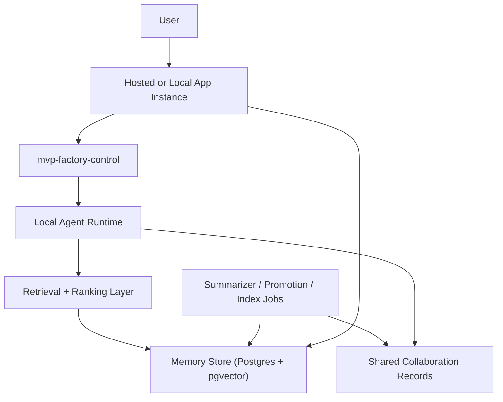

# AI Memory Platform Implementation Plan

This document defines the implementation plan for a durable AI memory platform inside `mvp-factory-control`.

**As implemented in repo:** Prisma models and API/UI are in `apps/mvp-factory-control` — see `src/lib/memory-platform.ts`, `src/app/memory/*`, and `src/app/api/memory/records/route.ts` (each file has a top comment). This plan remains the design narrative; when the two diverge, treat **code + schema** as source of truth and update this document.

The goal is not online model training.

The goal is a reliable, maintainable, supportable, fail-safe memory and retrieval system that lets:

- each app have its own scoped memory instance,
- each user have a personalized profile,
- each agent retrieve relevant context safely,
- selected entities communicate through explicit shared channels,
- the whole system improve over time from durable memory, retrieval, review, and audit.

## Outcome

The target operating model is:

- one shared memory platform,
- many app instances,
- many user profiles,
- explicit app-user memory overlays,
- explicit shared-memory promotion for cross-entity collaboration,
- retrieval-backed local agents that become more useful day by day without unsafe self-training.

## Design Principles

- **Database as source of truth**: structured records and memory state live in PostgreSQL.
- **Isolation by default**: app memory and user memory are scoped; nothing is globally shared unless promoted.
- **Shared by policy**: cross-entity communication uses explicit shared records and permissions.
- **RAG over retraining**: retrieval, summarization, and memory promotion are preferred over fine-tuning.
- **Structured plus semantic retrieval**: use exact filters, keyword search, and vector search together.
- **Fail-safe degradation**: if embeddings or vector search fail, agents continue with structured and keyword retrieval.
- **Traceability**: every important answer and action must be attributable to retrieved evidence and memory records.
- **Human control**: promotion of durable knowledge must support review and approval.
- **Operational simplicity**: prefer Postgres plus `pgvector` over introducing a separate vector database early.

## Target Architecture

## Memory Model

### 1. Global Memory

Portfolio-wide and platform-wide rules:

- security rules,
- operating principles,
- approved SOPs,
- global architecture rules,
- escalation rules.

### 2. App Instance Memory

One scoped memory space per product or managed app:

- architecture,
- business rules,
- glossary,
- incidents,
- customer or domain knowledge,
- deployment assumptions,
- known issues,
- decision history.

### 3. User Profile Memory

One memory profile per user:

- preferences,
- communication style,
- risk tolerance,
- workflow habits,
- role-specific defaults,
- recurring instructions.

### 4. App-User Overlay Memory

Personalized context for one user working inside one app:

- preferred output format for that app,
- app-specific shortcuts,
- approved exceptions,
- persistent collaboration context.

### 5. Shared Collaboration Memory

Explicitly promoted memory used for controlled cross-entity communication:

- published insights,
- approved decisions,
- handoff packets,
- cross-app requests,
- routed summaries.

## Recommended Technical Stack

### Primary Store

- PostgreSQL
- `pgvector`

### Retrieval Layers

- structured SQL filters,
- keyword search,
- semantic vector search,
- recency and confidence ranking.

### Runtime Components

- memory service API,
- ingestion/indexer jobs,
- summarization/promotion jobs,
- agent retrieval client,
- audit/event log,
- policy engine for visibility and promotion.

### Why This Stack

- fewer moving parts,
- simpler backup and restore,
- simpler operations,
- easier consistency,
- easier support,
- easier to reason about compared with adding a separate vector database at the start.

## Reliability Model

The platform should degrade safely:

- if embeddings fail, use structured plus keyword retrieval,
- if vector search fails, use exact-scope retrieval only,
- if promotion jobs fail, no durable memory is promoted,
- if confidence is low, the agent cites uncertainty or asks,
- if one app memory is damaged, other apps remain isolated,
- if shared memory is unavailable, app-local work still continues.

## Security Model

- app scope required for app records,
- user scope required for user profile records,
- app-user scope required for overlay records,
- shared memory only from explicit promotion,
- support approval states:
  - `DRAFT`
  - `SYSTEM_PROPOSED`
  - `HUMAN_APPROVED`
  - `SUPERSEDED`
  - `REVOKED`
- store provenance for every promoted memory item,
- store actor, source, timestamp, and confidence.

## Retrieval Contract

Each agent request should resolve context in this order:

1. global rules,
2. app memory,
3. user profile,
4. app-user overlay,
5. recent episodic context,
6. optional shared collaboration memory.

The retrieval result should return:

- matching records,
- source references,
- confidence,
- why each record was selected,
- which scope each record came from.

## Memory Promotion Contract

Not every output becomes memory.

Promotion should happen only when:

- the information is stable enough,
- it is useful beyond one session,
- it is attributable to evidence,
- it passes policy checks,
- it is either system-approved by rules or human-approved where required.

## Cross-Entity Communication Model

Entities should not read each other’s private memory by default.

Communication should happen through:

- explicit shared records,
- explicit handoff packets,
- task-linked messages,
- approved collaboration channels,
- provenance and audit logs.

This makes future app-to-app and user-to-user AI coordination possible without memory contamination.

## Implementation Phases

### Phase 1. Memory Foundations

Build the durable platform foundation:

- memory schema,
- scope model,
- audit/event log,
- migration strategy,
- service contract.

### Phase 2. Retrieval Layer

Build query and ranking:

- structured scope filters,
- keyword retrieval,
- vector embeddings and semantic search,
- retrieval ranking contract.

### Phase 3. Agent Integration

Integrate local agents with the retrieval layer:

- request-scoped retrieval,
- memory context injection,
- retrieval evidence logging,
- fail-safe fallbacks.

### Phase 4. Learning Loop

Build summarization and promotion:

- session summarization,
- durable memory promotion,
- confidence scoring,
- acceptance/rejection feedback loop.

### Phase 5. Multi-Tenant Collaboration

Enable future inter-entity collaboration safely:

- shared memory channels,
- handoff artifacts,
- explicit export/import,
- cross-app communication controls.

### Phase 6. Operations and Supportability

Make the platform supportable:

- health and metrics,
- repair tooling,
- reindexing,
- backfills,
- backup and restore,
- admin documentation.

## Deliverable Issue Breakdown

The following issue set is the recommended initial breakdown. All items belong to:

- `Product`: `mvp-factory-control`
- `Type`: `Refactor`
- `Priority`: `P0`

### Issue 1. Define memory platform architecture and ADR

Purpose:
- lock the platform direction before implementation work starts.

Deliverables:
- architecture doc,
- ADR for scoped memory,
- source-of-truth glossary for memory terms.

Acceptance:
- architecture, scope model, and failure model are documented,
- terms such as app instance, user profile, overlay memory, and shared memory are unambiguous,
- future issues can reference the ADR instead of re-arguing design.

### Issue 2. Add Postgres schema for scoped memory and audit events

Purpose:
- create the canonical durable memory model.

Deliverables:
- tables for app instances,
- user profiles,
- memory records,
- memory sources,
- promotion states,
- visibility rules,
- audit events.

Acceptance:
- migrations are present,
- schema supports global, app, user, app-user, and shared scopes,
- all memory rows can be traced to a source and actor.

### Issue 3. Add pgvector and embedding index support

Purpose:
- enable semantic retrieval without a second database.

Deliverables:
- `pgvector` support,
- embedding columns,
- indexing strategy,
- embedding refresh workflow.

Acceptance:
- semantic search is possible per scope,
- embeddings can be backfilled and refreshed,
- the system still works if embeddings are unavailable.

### Issue 4. Build memory service API and repository layer

Purpose:
- centralize all memory reads and writes behind a stable service boundary.

Deliverables:
- repository layer,
- CRUD service layer,
- scope-aware APIs,
- validation and policy checks.

Acceptance:
- callers do not write directly to raw memory tables,
- scope and visibility checks are enforced in one place,
- service returns stable typed contracts.

### Issue 5. Build retrieval orchestration with hybrid ranking

Purpose:
- make agent retrieval reliable and relevant.

Deliverables:
- structured retrieval,
- keyword retrieval,
- semantic retrieval,
- ranking and dedupe layer,
- retrieval evidence payload.

Acceptance:
- retrieval can merge multiple scopes,
- retrieval explains why items were selected,
- fallback mode works when vector retrieval is down.

### Issue 6. Add app-instance and user-profile provisioning

Purpose:
- support one personalized memory instance per app and per user.

Deliverables:
- provisioning flow,
- identity mapping,
- app registry mapping,
- user profile initialization.

Acceptance:
- new app instances can be created without schema edits,
- new user profiles can be created without manual DB surgery,
- app and user data remain isolated by default.

### Issue 7. Add app-user overlay memory

Purpose:
- support personalized behavior for a specific user within a specific app.

Deliverables:
- overlay storage,
- overlay retrieval precedence,
- overlay update rules.

Acceptance:
- one user can have app-specific preferences without affecting others,
- overlay memory participates in retrieval only when both app and user match.

### Issue 8. Integrate local agents with memory retrieval

Purpose:
- give agents scoped memory-backed context at runtime.

Deliverables:
- retrieval client for local agents,
- prompt context injection,
- evidence logging for decisions and outputs.

Acceptance:
- agents retrieve memory by scope,
- retrieval source records are logged,
- agents can continue operating in reduced mode if memory retrieval fails.

### Issue 9. Add episodic memory, session summarization, and memory promotion jobs

Purpose:
- convert repeated experience into durable memory safely.

Deliverables:
- episodic session records,
- summarization jobs,
- promotion pipeline,
- promotion confidence and policy checks.

Acceptance:
- noisy short-term history stays separate from durable memory,
- only approved or policy-valid summaries become durable memory,
- promotion failures do not corrupt canonical memory.

### Issue 10. Add human review and approval workflow for durable memory

Purpose:
- keep the system safe and supportable.

Deliverables:
- review states,
- approval UI or admin flow,
- revoke/supersede workflow,
- reviewer audit trail.

Acceptance:
- durable memory can be reviewed and revoked,
- sensitive shared memory requires approval where configured,
- all approvals are auditable.

### Issue 11. Add explicit shared-memory channels for cross-entity communication

Purpose:
- allow future app-to-app and user-to-user coordination without leaking private memory.

Deliverables:
- shared memory channel model,
- export/import flow,
- handoff artifact model,
- scope-safe collaboration contract.

Acceptance:
- entities can publish approved knowledge into shared channels,
- consumers can retrieve only shared and authorized records,
- private memory is not implicitly exposed.

### Issue 12. Add observability, repair tooling, and operational runbooks

Purpose:
- make the platform supportable in production.

Deliverables:
- health endpoints,
- metrics,
- dead-letter or failed-promotion visibility,
- backfill and reindex tools,
- backup/restore documentation,
- operator runbook.

Acceptance:
- operators can detect degraded memory state,
- embeddings and indexes can be rebuilt safely,
- promotion failures are diagnosable,
- restore procedures are documented and testable.

## Delivery Order

Recommended execution order:

1. Issue 1
2. Issue 2
3. Issue 3
4. Issue 4
5. Issue 5
6. Issue 6
7. Issue 7
8. Issue 8
9. Issue 9
10. Issue 10
11. Issue 11
12. Issue 12

## Dependency Map

- Issue 1 blocks all others.
- Issue 2 blocks Issues 3, 4, 6, 7, 9, 10, 11, 12.
- Issue 3 blocks Issues 5 and 9.
- Issue 4 blocks Issues 5, 8, 9, 10, 11.
- Issue 5 blocks Issue 8.
- Issue 6 blocks Issues 7 and 8.
- Issue 7 blocks Issue 8.
- Issue 8 blocks Issues 9 and 11.
- Issue 9 blocks Issue 10.
- Issue 10 blocks Issue 11 for approved shared-memory promotion.

## Success Criteria

The implementation is successful when:

- each app has an isolated memory instance,
- each user has an isolated profile,
- each app-user pair can have personalized overlay memory,
- agents retrieve relevant memory by scope,
- durable memory promotion is safe and auditable,
- cross-entity communication uses explicit shared channels,
- the system remains operational when embeddings or vector search fail,
- operators can support, reindex, repair, and restore the platform without guesswork.
