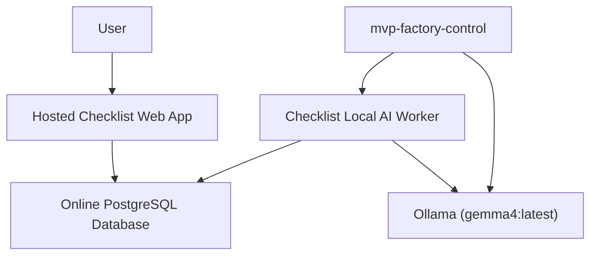

# System Architecture: MVP Factory Control and Checklist Local AI

This document defines the high-level architecture for the `mvp-factory-control` control plane and the production operating model for `{checklist}`.

The design goal is simple:

- keep the hosted web app independent from any operator laptop,
- keep the local AI runtime limited to Ollama plus one worker,
- make `mvp-factory-control` the supervisor for the local AI worker,
- remove OpenClaw from the Checklist critical path.

## Design Principles

- **Hosted UI, local worker**: the browser talks only to the hosted Checklist application.
- **Database as source of truth**: all raw data, flashcards, recommendations, and human actions are persisted in the online database.
- **Worker, not gateway**: the local AI process is a polling worker. It is not a browser-facing bridge.
- **Few moving parts**: the Checklist runtime depends on the hosted app, the hosted database, Ollama, and one local worker.
- **Deterministic supervision**: `mvp-factory-control` is responsible for starting, stopping, and observing Ollama and the Checklist local worker.

## High-Level Topology

## Checklist Pipeline

The intended Checklist operating loop is:

1. Users upload raw data through the hosted web application.
2. The hosted app writes raw data into the online database.
3. The local AI worker polls the database for new or changed company data.
4. The local AI worker builds a source bundle from structured records and uploaded files.
5. The local AI worker optionally enters an explicit research phase:
   - discover related public sources from seed URLs and search queries,
   - fetch source text,
   - apply fact-check rules,
   - store citations and evidence metadata.
6. The local AI worker uses Ollama `gemma4:latest` to generate or refresh flashcards from the grounded evidence bundle.
7. The local AI worker uses the active flashcards to generate or refresh recommendations.
8. The local AI worker writes flashcards, recommendations, and evidence metadata back to the online database.
9. Users review, modify, accept, decline, and complete items in the hosted web app.
10. The hosted app records every change in the online database.
11. The local AI worker polls again, detects the changes, and updates outputs when needed.

## Checklist Domain Model

The current online database already supports the worker model directly:

- `Company`: company-level business context.
- `Product`, `Customer`, `Competitor`, `UploadedSourceFile`: raw input sources.
- `Flashcard`: synthesized knowledge artifacts generated from source records.
- `FlashcardSource`: provenance links from a flashcard to raw sources.
- `FlashcardAction`: user review actions on flashcards.
- `NBAItem`: recommendations generated from flashcards.
- `Feedback`: user review actions on recommendations.

## Component Responsibilities

### Hosted Checklist web app

- Accepts uploads and structured edits.
- Persists all state to the online database.
- Displays raw data, flashcards, and recommendations.
- Captures user review actions and status changes.
- Does **not** connect to localhost.

### Online database

- Stores all raw inputs and all derived outputs.
- Acts as the shared contract between hosted app and local AI worker.
- Preserves human edits, review states, timestamps, and provenance.

### Checklist local AI worker

- Runs on the local Mac under `mvp-factory-control` supervision.
- Polls for new or changed company data.
- Generates flashcards from raw records and uploaded files.
- Optionally runs an explicit research phase for source discovery and fact-checking.
- Generates recommendations from active flashcards.
- Writes outputs back to the same online database.
- Maintains worker health and version metadata.

## Research Phase 2 Model

Checklist research is an explicit capability, not an implicit always-on dependency.

### Goals

- discover useful public sources related to the uploaded and structured company data,
- fact-check model outputs against fetched source material,
- keep evidence attributable and auditable,
- refresh evidence over time without changing the hosted app contract.

### Operating Rules

- Research is controlled by worker configuration under `mvp-factory-control`.
- If research is disabled, the worker remains fully functional using only first-party source data.
- If research is enabled, the worker may:
  - fetch source URLs already present in `Product`, `Competitor`, or uploaded files,
  - run bounded search queries,
  - fetch a small number of candidate pages,
  - record citations, domains, snippets, and fetch timestamps in `Flashcard.evidence`.
- Research must never be required for the web app to function.

### Fact-Check Contract

When research is enabled, each generated flashcard should carry:

- a fact-check status,
- one or more citations when public evidence exists,
- evidence metadata in `Flashcard.evidence`,
- supporting lineage in `FlashcardSource` using `AGENT_FOUND` for discovered web sources.

The worker should score evidence using simple deterministic rules such as:

- number of usable citations,
- number of distinct corroborating domains,
- whether the finding is grounded only in first-party source material,
- whether the research run failed or returned insufficient evidence.

### Time-Based Refresh

Research must be refreshable independently of raw source edits.

That means the worker may re-run the research phase on a configured interval even when:

- raw source rows have not changed,
- the flashcard fingerprint is still the same,
- the goal is to refresh evidence and recommendations with newer public information.

### Ollama

- Runs locally on the Mac.
- Provides the only model runtime required for the Checklist worker.
- Standard model for Checklist: `gemma4:latest`.

### mvp-factory-control

- Starts and monitors Ollama.
- Starts and monitors the Checklist local AI worker.
- Surfaces health state for local services.
- Keeps Checklist worker operations separate from browser-facing traffic.

## Service Boundaries

Checklist production depends on these runtime boundaries:

- **Hosted boundary**:
  - hosted Checklist web app
  - online PostgreSQL database
- **Local boundary**:
  - `mvp-factory-control`
  - Ollama
  - Checklist local AI worker

OpenClaw is not part of the Checklist production path.

## Why OpenClaw Is Removed From the Checklist Path

The hosted web app does not need a socket or gateway into the operator laptop to achieve the Checklist workflow.

The required contract is:

- hosted app writes data,
- local worker reads data,
- local worker writes outputs,
- hosted app renders and records human actions.

That means a localhost gateway adds operational complexity without adding necessary product capability.

## Reliability Model

The Checklist path is considered healthy when all of the following are true:

- hosted Checklist web app is reachable,
- the online database is reachable,
- Ollama is reachable on `127.0.0.1:11434`,
- the Checklist local AI worker is reachable on `127.0.0.1:10005`,
- the worker reports database connectivity and model readiness,
- poll cycles complete without repeated generation failures.

## Implementation Notes

- The Checklist worker should call Ollama directly over local HTTP.
- The worker should use a single configured model by default: `gemma4:latest`.
- The research phase should be explicitly enabled through worker configuration.
- Derived artifacts should be idempotent and source-linked.
- Human-reviewed records should not be silently overwritten.
- Removed or superseded worker-generated flashcards should be marked stale rather than deleted.

## Non-Goals

- No browser-to-localhost dependency for Checklist.
- No OpenClaw requirement for Checklist generation.
- No multi-service local inference chain for Checklist.
- No dependence on public tunnel URLs for worker execution.

## Internal control app in this repository (`apps/mvp-factory-control`)

The Next.js App Router application is **portfolio control-plane UI and API**, not the hosted Checklist product. It uses **PostgreSQL** via Prisma (`prisma/schema.prisma`), NextAuth (Google + optional dev credentials), and the GitHub GraphQL API for board/project fields.

### Runtime layout

| Area | Path | Role |
|------|------|------|
| Pages (RSC) | `src/app/**/page.tsx` | Dashboard, issues, agents, products, chat, memory, settings, sign-in |
| Server actions | `src/app/**/actions.ts` | Mutations after session/RBAC; revalidate paths |
| API routes | `src/app/api/**/route.ts` | NextAuth, email ingress, orchestrator JSON, memory REST |
| Domain logic | `src/lib/*.ts` | Tasks, alpha context, GitHub client, tool policy, memory platform, RBAC, etc. |
| Worker | `scripts/worker.js` + `scripts/lib/*.js` | CommonJS mirrors of tool protocol/policy/executors; runs tasks out-of-band |
| Design tokens | `src/app/globals.css`, `src/components/ui.tsx` | War Room styling; see `docs/design-system-lts.md` |
| Operator settings file | `.mvp-factory-control/settings.json` | Written by `settings-store.ts` / settings UI |

### Guardrails and orchestration (code truth)

- **Task lifecycle** — `lifecycle-policy.ts` (pure rules) + audits in Prisma.
- **Pre-enqueue gates** — `judgement-gates.ts` (readiness, ALPHA/BETA control intent).
- **Alpha context** — `alpha-context.ts`: window lifecycle, **60%** warning / **70%** block without handover package (`deriveGuardrailState`).
- **Tool execution** — `tool-call-protocol.ts`, `tool-command-policy.ts`, `tool-call-approval.ts`; worker enforces the same shapes in `scripts/lib/*`.
- **Orchestrator lease** — `orchestrator-lease.ts` + introspection snapshot `orchestrator-introspection.ts`.

### Related Documents

- [INTERNAL_CONTROL_APP.md](./INTERNAL_CONTROL_APP.md)
- [BUILD_AND_RUN.md](./BUILD_AND_RUN.md)
- [EXECUTABLE_PROMPT_PACKAGE.md](./EXECUTABLE_PROMPT_PACKAGE.md)

## Related Documents

- [CHECKLIST_SYNC_RELIABILITY.md](./CHECKLIST_SYNC_RELIABILITY.md)
- [CHECKLIST_SYSTEM_REFACTORING.md](./CHECKLIST_SYSTEM_REFACTORING.md)
- [BUILD_AND_RUN.md](./BUILD_AND_RUN.md)
