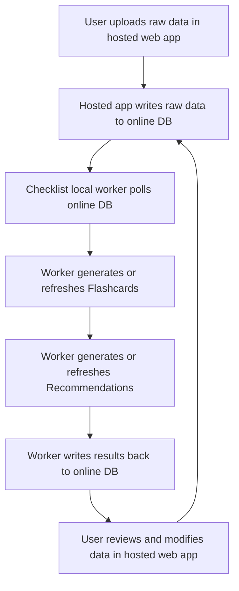

# Checklist System Refactoring

**Scope:** Target architecture for Checklist vs local supervisor. For what the control repository actually runs today, cross-check `docs/ARCHITECTURE.md` (internal app section) and tray code comments in `scripts/control_mvp.py`.

This document records the target refactoring for Checklist and the implementation work completed to establish a simpler and more reliable foundation.

## Objective

Refactor Checklist into a worker-based architecture with the minimum practical runtime:

- hosted web app,
- online database,
- local Ollama,
- one local Checklist AI worker supervised by `mvp-factory-control`.

## Target Architecture

## Refactoring Plan

### 1. Remove OpenClaw from the Checklist production path

- Stop treating OpenClaw as a required Checklist runtime dependency.
- Remove OpenClaw from control-plane health pages for Checklist operations.
- Document the Checklist runtime as web app + DB + Ollama + local worker only.

### 2. Make `mvp-factory-control` own the local AI runtime

- Ensure `mvp-factory-control` starts Ollama.
- Ensure `mvp-factory-control` starts the Checklist local AI worker.
- Ensure health views show Checklist worker and Ollama directly.

### 3. Simplify the worker’s inference contract

- Standardize on `gemma4:latest`.
- Remove multi-model fallback chains that drift from the installed Ollama state.
- Report model readiness in worker health output.

### 4. Expand the worker from recommendation-only to full artifact generation

- Read raw source tables:
  - `Product`
  - `Customer`
  - `Competitor`
  - `UploadedSourceFile`
- Generate `Flashcard` rows with source lineage in `FlashcardSource`.
- Generate `NBAItem` rows from active flashcards.

### 5. Preserve human control

- Use worker fingerprints to identify generated flashcards.
- Avoid silently overwriting reviewed content.
- Mark superseded generated flashcards as `STALE` instead of deleting them.
- Keep accepted, declined, completed, and modified recommendation states intact.

### 6. Tighten the worker feedback loop

- Poll for changes in raw source tables.
- Poll for changes in flashcard actions and recommendation feedback.
- Recompute outputs only when the company snapshot changes.

## Implementation Record

The following changes were completed as part of this refactor:

### Documentation

- Rewrote the main architecture document to describe the worker-first Checklist model.
- Added this refactoring document as the source of truth for the migration.
- Updated the Checklist reliability document to reflect the new architecture.
- Updated the build/run guidance so the local AI path is centered on Ollama plus the Checklist worker.
- Added [`docs/CHECKLIST_WORKER_HEALTH_CONTRACT.md`](CHECKLIST_WORKER_HEALTH_CONTRACT.md) as the worker `/health` contract for the parallel Checklist codebase.

### Control plane

- `mvp-factory-control` now treats Ollama and the Checklist worker as the Checklist local AI runtime.
- Checklist worker configuration uses direct local Ollama access instead of a local HTTPS proxy hop.
- The connector status page no longer presents OpenClaw as part of the Checklist runtime.
- Supervisor `/health` drift checks use a versioned contract (`supervisorContractVersion` / `CHECKLIST_CONTRACT_VERSION` in `scripts/checklist_control_defaults.py`); research on/off and fact-check floors are part of the saved settings surface. Full extended parity applies only when the worker’s `/health` includes every extended `settings` key; otherwise the tray compares the legacy subset only.

### Worker

- The Checklist worker now uses `gemma4:latest` as the default generation model.
- The worker now understands raw source files in addition to structured records.
- The worker now generates flashcards with provenance records.
- The worker now generates recommendations from active flashcards.
- The worker tracks richer snapshots so changes in raw data, flashcards, flashcard actions, files, and recommendation feedback can trigger recomputation.
- Worker health output now reports model and database readiness together.

## Best-Implementation Guidance

The best next phase after this refactor is:

1. Move from polling to a lightweight job queue only if polling becomes a measured bottleneck.
2. Add a controlled research phase with explicit search, citation capture, and fact-check rules.
3. Add focused integration tests around flashcard generation, recommendation generation, stale-card handling, and research evidence scoring.
4. Add dashboard metrics for:
   - last successful poll,
   - last successful flashcard generation,
   - last successful recommendation generation,
   - last successful research refresh,
   - generation failure counts,
   - research failure counts,
   - per-company queue depth or pending review counts.
5. Add a dedicated maintenance command to reprocess one company or one source object on demand.

## Phase 2 Research Refactor

### Objective

Add a controlled internet research layer on top of the stable Checklist worker foundation.

This phase must:

- keep the worker operational when public research is unavailable,
- make fact-checking explicit and auditable,
- refresh evidence and recommendations over time,
- preserve the simple hosted-app to online-DB contract.

### Implementation Plan

1. Add explicit worker configuration for research enablement, provider selection, fetch limits, and refresh cadence.
2. Build source discovery from:
   - existing source URLs already stored in Checklist data,
   - bounded search queries derived from company and source context.
3. Fetch and normalize public source pages into a compact research bundle.
4. Apply deterministic fact-check rules:
   - count usable citations,
   - count distinct domains,
   - classify evidence state,
   - cap flashcard confidence based on evidence quality.
5. Persist research output in existing Checklist structures:
   - citations and fact-check metadata in `Flashcard.evidence`,
   - discovered public sources as `FlashcardSource` rows using `AGENT_FOUND`,
   - generated body content that includes a compact citation summary for user visibility.
6. Refresh research on a time interval even when source rows have not changed.
7. Keep recommendation generation grounded in the strongest active flashcards first.

### Phase 2 Implementation Record

The following work was completed:

- Added an explicit research configuration surface to the Checklist worker runtime.
- Added source discovery from seed URLs and bounded web search.
- Added public-page fetch and normalization for research evidence.
- Added deterministic fact-check scoring and evidence-status classification.
- Added citation capture in `Flashcard.evidence`.
- Added supporting `FlashcardSource` lineage for agent-discovered web sources.
- Added time-based research refresh behavior in the poll loop.
- Updated the control plane to treat research as an owned Checklist worker capability.

### Phase 2 Success Criteria

Checklist research is considered correctly implemented when:

- research can be enabled or disabled without changing the hosted web app,
- the worker remains healthy when research is unavailable,
- flashcards include auditable evidence metadata,
- discovered public sources are traceable,
- confidence scores reflect evidence quality,
- recommendations are refreshed from the strongest available grounded flashcards,
- the worker can refresh knowledge on schedule even without raw-row edits.

## Success Criteria

Checklist has a solid foundation when:

- the web app works without any localhost dependency,
- the local AI runtime is only Ollama plus the Checklist worker,
- `mvp-factory-control` can bring the local worker up automatically,
- flashcards and recommendations are both regenerated from online data,
- human edits remain durable and visible in the hosted app.
